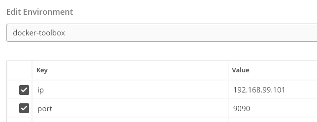

# MATTEI SIMON : Rapport Labo HTTP

## Partie 1 : Configuration serveur apache

Image Docker utilisée : `php:7.2.30-apache` - https://hub.docker.com/layers/php/library/php/7.2.30-apache/images/sha256-8b1a97fafd2ebf432658b4fdbaadd0d0531d1c55550d3ae9b8d77896697acb17?context=explore

Adresse IP de docker toolbox\


Premier lancement du serveur apache


Première Connexion, Serveur vide\


### Configuration serveur perso

Dockerfile
```
FROM php:7.2.30-apache
COPY srcHTML/ /var/www/html/
```

srcHTML doit se trouver dans le même dossier que le Dockerfile, qui va ensuite copier les ressources pour les envoyer dans le dossier html du serveur apache 7.2.30, qui est le dossier défini par la configuration par défaut du fichier ```/etc/apache2/sites-enable/000-default.conf```

Pour créer une image depuis le Dockerfile, puis ensuite créer un ou plusieurs containers
```
docker build -t <IMG_NAME> <PATH_TO_DOCKERFILE> 
docker run -d -p <PORT>:80 <IMG_NAME>
```

Dans le cas ou mon port est 7778 et mon localhost 192.168.99.101


## Partie 2 : Serveur HTTP dynamique avec express.js

### 2.1 : Configuration de Node.js

Image Docker utilisée : `node:12.16.3`

DockerFile
```
FROM node:12.16.3
COPY src /opt/app
CMD ["node","/opt/app/index.js"]
```

fichier package.json, crée grâce à l'utilitaire `npm` de node
```json
{
  "name": "tryingtomakethiswork",
  "version": "1.0.0",
  "description": "part 2 for my lab",
  "main": "index.js",
  "scripts": {
    "test": "echo \"Error: no test specified\" && exit 1"
  },
  "author": "Simon Mattei",
  "license": "ISC",
  "dependencies": {
    "chance": "^1.1.4"
  }
}
```

index.js
```javascript
var Chance = require('chance');
var chance = new Chance();

console.log("Gnar's birthday is on " + chance.birthday())
```

Arborescence des fichiers


Exécution de l'image


### 2.2 : Configuration du framework Express.js

Fichier package.json, cette fois avec les dépendances sur Express, et sur animals qui va nous permettre de générer des animaux aléatoires
```json
{
  "name": "tryingtomakethiswork",
  "version": "1.0.0",
  "description": "part 2 for my lab",
  "main": "index.js",
  "scripts": {
    "test": "echo \"Error: no test specified\" && exit 1"
  },
  "author": "Simon Mattei",
  "license": "ISC",
  "dependencies": {
    "animals": "0.0.3",
    "chance": "^1.1.4",
    "express": "^4.17.1"
  }
}
```

Cette fois si, une requête GET sur notre serveur leur enverra les 3 "LuckyAnimals" de la requête!
```javascript
var animals = require('animals');

const express = require('express')
const app = express()
const port = 3000

app.get('/', (req, res) => res.send(generateLuckyAnimals()))

app.listen(port, () => console.log(`Example app listening at http://localhost:${port}`))

function generateLuckyAnimals() {
    console.log("Recieved a request for lucky animals");
    var luckyAnimals = [];

    for(var i = 0; i < 3; i++)
        luckyAnimals.push({
            luckyAnimalID : i,
            animal : animals()
        });

    console.log(luckyAnimals);
    return luckyAnimals;
}
```
Après les commandes `ducker build` et `docker run`, on a doc un serveur qui tourne en port-mapping sur ``192.168.99.101:9090``, qui va écouter sur le port 3000 de notre container docker. On peut ensuite tester notre serveur en lui envoyant des requêtes `GET` pour voir si on reçoit bien nos animaux :)

Configuration de l'environnement docker-toolbox sur postman



Requête `GET` à notre serveur


## Partie 3 : Reverse proxy avec apache

Dans le fichier `/etc/apache2`, on y retrouver plusieurs scripts intéressants pour la configuration d'un serveur proxy:
- a2enmnod : Permet d'activer des modules, notamment pour la configuration d'un serveur proxy
- a2ensite : Permet d'activer des sites différents

Ceci permet d'héberger plusieurs sites logiques sur la même infrastructure. Dans notre cas, le reverse proxy sera un site! Pour ceci, on doit configurer notre fichier `001-reverse-proxy.conf` qui va définir quelle entête `host` on doit indiquer dans notre requête HTTP pour accéder au site choisi.

Pour configurer notre fichier, il faut savoir quelles adresses IPs leurs ont été attribuées. De manière générale, il faut configurer ces adresses de manière dynamique. Ici, de manière a comprendre, nous allons les configurer de manière statique.


La configuration est la suivante :
```
<VirtualHost *:80>
	ServerName gnar.ch

	ProxyPass "/api/gnar/" "http://172.17.0.3:3000/"
	ProxyPassReverse "/api/gnar/" "http://172.17.0.3:3000/"

	ProxyPass "/" "http://172.17.0.2:80/"
	ProxyPassReverse "/" "http://172.17.0.2:80/" 
</VirtualHost>
```

Il est important que la configuration plus générale soit en dernier. Il faut ensuite enable notre configuration dans le dossier `/etc/apache2/sites-enabled`, grâce au script `a2ensite 001*`. Il faut également activer les modules nécessaire à l'activation du serveur reverse proxy grâce à `a2enmod proxy` et `a2enmod proxy_http`. Pour finir, `service apache2 reload` permet de charger notre configuration.

Dockerfile

```
FROM php:7.2.30-apache

COPY conf/ /etc/apache2

RUN a2enmod proxy proxy_http
RUN a2ensite 000-* 001-*
```