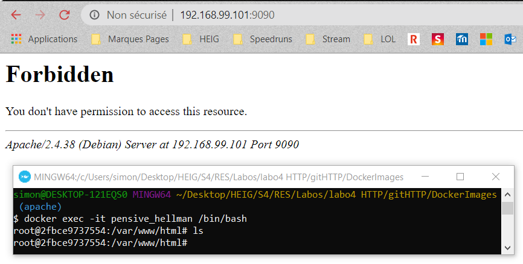

# MATTEI SIMON : Rapport Labo HTTP

## Partie 1 : Configuration serveur apache

Image Docker utilisée : php:7.2.30-apache - https://hub.docker.com/layers/php/library/php/7.2.30-apache/images/sha256-8b1a97fafd2ebf432658b4fdbaadd0d0531d1c55550d3ae9b8d77896697acb17?context=explore

Adresse IP de docker toolbox\


Premier lancement du serveur apache


Première Connexion, Serveur vide\



### Configuration serveur perso

Dockerfile
```
FROM php:7.2.30-apache
COPY srcHTML/ /var/www/html/
```

srcHTML doit se trouver dans le même dossier que le Dockerfile, qui va ensuite copier les ressources pour les envoyer dans le dossier html du serveur apache 7.2.30, qui est le dossier défini par la configuration par défaut du fichier ```/etc/apache2/sites-enable/000-default.conf```

Pour créer une image depuis le Dockerfile, puis ensuite créer un ou plusieurs containers
```
docker build -t <IMG_NAME> <PATH_TO_DOCKERFILE> 
docker run -d -p <PORT>:80 <IMG_NAME>
```

Dans le cas ou mon port est 7778 et mon localhost 192.168.99.101


## Partie 2 : Serveur HTTP dynamique avec express.js
